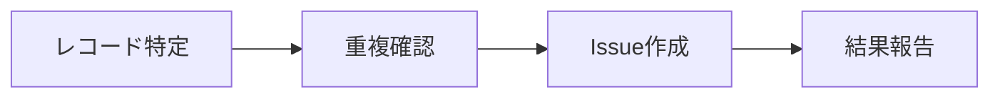

# CLAUDE.md

## How to Work

> Simple is the best.

要件を満たすための、本質的かつ必要最小限の作業を実施する。
成果物は最小要素で構築し、必要以上を作らない。
すでにある成果物を変更する場合は、部分的な追加や修正を施すのではなく、
全体を俯瞰した際に最適解となるように要件を落とし込み、必要最小限の構成や変更差分で実現する。

## Communication

成果物と説明について、固有名詞や専門用語はそのままに、言い回しは一般的な言葉で記載する。
読み手が前提知識なしに理解できることを最優先し、一般的でない略称や実装上の呼称は普通の言葉へ言い換える。

創造性が必要ない作業では必要十分な会話で応答し、選りすぐりの洗練された言葉による会話を心掛ける。

## Engineering

### Single Source of Truth

ドキュメント・コード・要件は、現在あるべき姿だけを記す。これを唯一にして単一の正とする。
時系列的な経緯や変更の都合を成果物に持ち込まない。「なぜ残したか」「以前はこうだった」「どの版で変えたか」といった、経緯を知る者にしか意味を成さない相対的な記述を排する。
経緯を知らない新たな読み手、すなわちユーザーや実装者が、いまの記述だけで理解を完結できるようにする。
変更は差分を末尾に積む追記ではなく、全体を現在の正へ再構成して反映する。経緯は git の歴史と Pull Request が担う。

### Fail Fast

フォールバックはエラーを隠蔽し、処理を複雑にする原因となる。エラーを握りつぶして代替値で処理を続けるのではなく、問題が起きた事実をそのまま表面化させる。
エラーを出力することを恐れない。早期に、明示的に失敗させることで、原因は隠れず、処理は単純に保たれる。

## Skills

作業を行う際は、そのタスクに関連する Skill を必ず確認し、適用する。

### `/playwright-cli`

`attach --cdp=chrome` でログイン済みの Chrome ブラウザに接続し、`playwright-cli tab-new` で新しいタブを開いて作業する。

Skill および Agent 向けの設定資産（Skill、ルール、フック等）は `~/.claude/` 配下で管理する。`~/.cursor/` 配下には新規作成しない。Skill を追加・更新するときは `~/.claude/skills/<skill-name>/SKILL.md` を編集し、必要に応じて同ディレクトリ内に reference ファイルを置く。

| Path | Purpose |
| :-- | :-- |
| `~/.claude/skills/` | ユーザー定義 Skill |
| `~/.claude/CLAUDE.md` | このリポジトリ全体の方針 |

`~/.cursor/skills-cursor/` は Cursor 組み込み Skill のため、ユーザー Skill の配置先としては使わない。

## Repository

このリポジトリは `ac-nakamura-y/.claude` を `origin`（作業用フォーク）とし、`yjn279/.claude` を `upstream`（参照用）として運用する。Pull Request は upstream ではなく、必ずフォーク側の `origin` に対して作成する。

| Remote | Repository | 用途 |
| :-- | :-- | :-- |
| `origin` | `ac-nakamura-y/.claude` | push 先、PR の base |
| `upstream` | `yjn279/.claude` | 参照・同期用（PR 作成先にしない） |

ブランチは `origin` に push し、PR は次の形式でフォーク向けに作成する。

```shell
git push -u origin <branch>
gh pr create --repo ac-nakamura-y/.claude --base main --head <branch>
```

`gh pr create --fill` のみでは upstream 向け PR になる場合があるため、必ず `--repo ac-nakamura-y/.claude` を指定する。

`upstream/main` は GitHub Actions（`.github/workflows/sync-upstream.yml`）で毎週月曜 9:00 JST に `main` へ自動 merge する。手動実行は Actions タブの「Sync upstream/main」から行える。コンフリクト時はワークフローが失敗するため、ローカルで解消して push する。

## Linear Operations

Notion DB の改善項目を Linear Issue 化するときは、Linear MCP を使う。詳細な手順とデフォルト値は `~/.claude/skills/linear/SKILL.md` を参照する。

Issue 作成の流れは、対象レコードの特定、重複確認、作成、結果報告の順である。



作成時のデフォルト値を以下に示す。

| Field | Value |
| :-- | :-- |
| team | `marutto-ops` |
| project | `[FDE] 制作プロセス改善` |
| status | `Triage` |
| priority | medium（ `3` ） |

重複が疑われる場合は `list_issues` で検索し、既存 Issue があるときは新規作成せずその URL を返す。旧 Issue を統合する場合は `duplicateOf` で Duplicate 化してから新 Issue を作成する。

## Notion Operations

Notion MCP は未認証のことが多い。DB の読み書きは Chrome の cookie を使った Notion 内部 API で行う。ローカル DB（ `~/Library/Application Support/Notion/notion.db` ）はキャッシュのため、書き込み前の状態確認には使わない。

### Read

最新の DB 状態は `queryCollection` で取得する。認証には Chrome Profile 3 の `token_v2` を `browser_cookie3` から取得する。プロパティは `block.value.value.properties` にネストされている。

### Write

DB プロパティの更新は `saveTransactions` を使う。Linear 列など特定プロパティだけを更新するときは、 `path` + `set` でその列のみ指定する。 `properties` 全体を `update` するとステータスなど他列が消えるため、使わない。

| 操作 | 方法 |
| :-- | :-- |
| Linear 列の更新 | `path: ["properties", "e~Y{"]` + `command: "set"` |
| ステータス列の更新 | ユーザー明示指示がある場合のみ |

更新用スクリプトは `~/Documents/marutto-operation/scripts/update-notion-linear-links.py` に置く。

### Browser

Notion の UI 操作が必要な場合は `playwright-cli` を使う。ログイン済み Chrome への接続は `attach --cdp=chrome` を試すが、リモートデバッグ未有効時は API 更新に切り替える。Chrome cookie 経由の API 更新が UI 操作より確実である。
