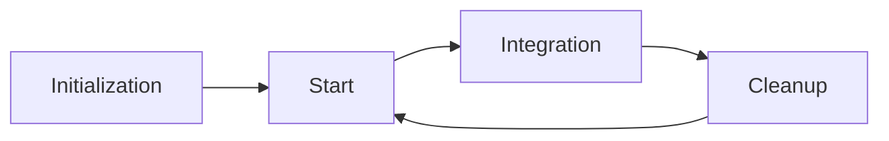

# Git Flow

このリポジトリにおける git 運用の方針を定める。リポジトリの本体ディレクトリ（worktree ではなく、常にベースブランチの最新をチェックアウトしておく場所）では直接作業はしない。変更はすべて作業ブランチと worktree 上で進め、Pull Request 経由で統合する。これにより、レビューを必ず通し、履歴を機能・修正単位で残し、問題発生時に特定コミットへ戻せる状態を保つ。

ライフサイクルは Initialization・Start・Integration・Cleanup の 4 フェーズからなる。全体像を以下に示す。



## Initialization

新規リポジトリを立ち上げるフェーズである。デフォルトブランチを `main` としたパブリックリポジトリを作成し、空コミットで履歴の起点を確立する。`master` は使わない。

```shell
git init -b main
git commit --allow-empty -m "Initial commit"
```

## Start

作業を開始するフェーズである。命名規則に従ったブランチを、ベースブランチの最新コミットから worktree として切り出す。worktree を独立させることで、ブランチを切り替えずに並行作業や緊急対応へ移れる。

ブランチ名は `<type>/<description>` 形式とする。`<type>` は変更の種類を表し、以下から選ぶ。

| type | 用途 |
| :-- | :-- |
| feat | 新機能の追加 |
| fix | バグ修正 |
| chore | コードに直接関係しない変更（ビルド・ツールなど） |
| docs | ドキュメントの変更 |
| refactor | 挙動を変えないコードの整理 |
| test | テストの追加・修正 |

`<description>` は変更内容が一言で伝わる kebab-case の英語動詞句とし、2〜5 語に収める。人名・連番・日付・ `tmp` ・ `wip` のような意味を持たない語は避ける。

| 評価 | 例 |
| :-- | :-- |
| 良い | `feat/add-search-filter` , `fix/login-redirect-loop` |
| 悪い | `feature1` , `tmp` , `yuji-branch` , `20260509` |

スラッグは次のいずれかを起点に生成する。

- Issue 番号がある場合: その Issue のタイトルや本文から変更内容を抽出してスラッグ化する。
- 要件文のみの場合: 要件を要約した動詞句を kebab-case に変換してスラッグとする。
- 継続対象の PR タイトルがある場合: PR タイトルをそのまま使わず、kebab-case・語数・避ける語の上記規約に合わせて整形する。

リポジトリパス（作業中のリポジトリ）とベースブランチ（既定 `origin/main`）は worktree 作成時に明示入力として要求せず、文脈から推測する。

worktree はベースブランチ（既定 `origin/main`、指定があれば対象のブランチや対象 Pull Request に対応するブランチ）の最新を起点に切り出す。配置先を `<repo-basename>.worktrees/` に統一することで、どのリポジトリでも worktree の場所が一貫し、ローカル専用ファイルのコピー先も固定しやすくなる。

- 配置先: 対象リポジトリの親ディレクトリ直下の `<repo-basename>.worktrees/` に置く（例: `ac-llm-platform` → `~/Documents/ac-llm-platform.worktrees/`）。
- 命名: ブランチ名の `/` を `-` に変換した文字列をディレクトリ名とする（例: ブランチ `feat/shiseido-setup` → `ac-llm-platform.worktrees/feat-shiseido-setup`）。
- 同名の worktree が既にあれば再利用する。

新規 worktree を作成するときの標準動作は次のとおりである。

1. 同名の worktree が既に存在する場合は新規作成せず、それを再利用する。作業ツリーが壊れているなど再利用できない事情がある場合に限り、削除してから再作成する。
2. ベースブランチの最新を取得し、`../<repo-basename>.worktrees/<変換後のブランチ名>` に worktree を作成する。
3. Git 管理外のローカル専用設定ファイル（例: `.env`、サービスアカウント JSON）が必要な場合は、メイン clone から対応する相対パスでコピーする（例: `cp .env ../ac-llm-platform.worktrees/feat-my-feature/.env`）。
4. 対応する `.code-workspace` の `folders` に worktree を追加する。
5. 作業ディレクトリに移動して即座に開発を始められる状態に整える。

```shell
git fetch origin <base>
git worktree add -b <type>/<description> ../<repo-basename>.worktrees/<dir> origin/<base>
```

## Integration

変更を Pull Request としてリモートへ統合するフェーズである。作業ブランチを push して PR を作成する。独断でマージせず、必ずレビューを依頼し、承認を得てからマージする。履歴を機能・修正単位の 1 コミットへ集約するため、マージ方式は squash に固定する。同一ブランチの PR が既に open であれば、新規に作らず追記 push に留める。

```shell
git push -u origin <type>/<description>
gh pr create --fill
gh pr merge --squash
```

統合を完了するには、worktree から本体ディレクトリへ戻り、自分がマージした PR に限らず origin の最新を fast-forward で取り込んで手元のベースブランチをマージ後の姿に揃える。fast-forward できない場合は、マージコミットを作ったり履歴を分岐させたりせず失敗させ、対応を利用者に委ねる。

```shell
cd "$(git rev-parse --git-common-dir)/.."
git pull --ff-only origin <base>
```

## Cleanup

統合が終わった作業の残骸を削除するフェーズである。worktree とブランチを削除し、関連する GitHub Issue をクローズする。**worktree 削除だけでは不十分**で、Cursor / VS Code 用の `.code-workspace` からも当該 worktree の `folders` エントリを除去する（Start で追加したものと対になる作業）。

クリーンアップの標準手順:

1. worktree を削除する
2. ローカルブランチを削除する
3. リモートブランチを削除する（マージ済みでリモートに残っている場合）
4. 関連する GitHub Issue をクローズする
5. `.code-workspace` の `folders` から当該 worktree のパスを除去する

```shell
cd "$(git rev-parse --git-common-dir)/.."
git worktree remove ../<repo-basename>.worktrees/<dir>
git branch -d <type>/<description>
git push origin --delete <type>/<description>
gh issue close <number> --reason completed
# .code-workspace の folders から ../<repo-basename>.worktrees/<dir> に相当するエントリを削除
```

## 例

### 例 1: 既存リポジトリで worktree を切り出して作業を開始する

`main` の最新を取得し、`fix/login-redirect-loop` ブランチを `origin/main` から派生させて `../ac-llm-platform.worktrees/fix-login-redirect-loop` に worktree を作成する。

```shell
git fetch origin main
git worktree add -b fix/login-redirect-loop ../ac-llm-platform.worktrees/fix-login-redirect-loop origin/main
# ローカル専用設定ファイルが必要な場合はコピーする（例: cp .env ../ac-llm-platform.worktrees/fix-login-redirect-loop/.env）
# ac-llm-platform.code-workspace の folders に当該 worktree を追加
cd ../ac-llm-platform.worktrees/fix-login-redirect-loop
```

### 例 2: PR を作成し、マージ後にクリーンアップする

```shell
git push -u origin fix/login-redirect-loop
gh pr create --fill
# レビュー承認後
gh pr merge --squash --delete-branch
cd "$(git rev-parse --git-common-dir)/.."
git pull --ff-only origin main
git worktree remove ../ac-llm-platform.worktrees/fix-login-redirect-loop
git branch -d fix/login-redirect-loop
# ac-llm-platform.code-workspace の folders から fix-login-redirect-loop を削除
gh issue close <番号> --reason completed
```
