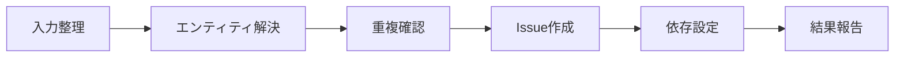

# Linear

会話・ドキュメント・URL・要件メモなど任意の情報源から Linear Issue を作成する。作成前に team と project の存在を確認し、重複がないことを検証してから `save_issue` を呼び出す。

## Tools

Linear MCP の `save_issue` `get_team` `get_project` `list_issue_statuses` `list_issues` `get_issue` を使う。

## Defaults

ユーザーが個別指定しない限り、すべての Issue に次の値を適用する。

| Field | Default |
| :-- | :-- |
| team | `marutto-ops` |
| project | `[FDE] 制作プロセス改善` |
| assignee | null |
| dueDate | null |
| priority | medium（Linear `3`） |
| status | `Triage` |
| parentId | 親 Issue がある場合のみ |
| labels | null |

priority の数値対応は `urgent=1` `high=2` `medium=3` `low=4` とする。team・project・priority・assignee・dueDate・labels はユーザーが明示した場合のみ上書きする。status はユーザー指定の有無にかかわらず常に `Triage` とし、Backlog や Todo には変更しない。

## Workflow

Issue 作成は入力整理、エンティティ解決、重複確認、作成、依存関係設定、結果報告の順で進める。



作業チェックリストは次のとおり。

- [ ] title・description・件数を確定する
- [ ] team・project・親 Issue を解決する
- [ ] 重複 Issue がないことを確認する
- [ ] `save_issue` で作成する（`state: Triage`）
- [ ] 必要なら `blockedBy` / `relatedTo` を設定する
- [ ] 作成結果を一覧で報告する

### Input

1 Issue あたり title・description・必要に応じて parentId・blockedBy・relatedTo を確定する。title は簡潔で検索可能とし、必要なら `[FDE]` などの prefix を付ける。description には背景、スコープ、完了条件、参考リンクを構造化して記載する。マイルストーンやチェックリストの分割では 1 項目を 1 Issue とする。

### Resolution

作成前に MCP で team と project の存在を確認する。親 Issue 候補がある場合は `list_issues` または `get_issue` で特定し `parentId` を設定する。

```text
get_team({ query: "marutto-ops" })
get_project({ query: "[FDE] 制作プロセス改善" })
list_issue_statuses({ team: "marutto-ops" })
```

### Duplicate Check

同タイトルまたは同内容の Issue が既にないか `list_issues` で検索する。見つかった場合は新規作成せず、既存 Issue を報告する。

### Creation

`save_issue` の基本形は次のとおり。assignee・dueDate・labels はデフォルト null のため省略する。

```yaml
title: "<title>"
team: marutto-ops
project: "[FDE] 制作プロセス改善"
state: Triage
priority: 3
description: |
  ## 背景・目的
  ...

  ## スコープ
  ...

  ## 完了条件
  ...
```

### Relations

後続 Issue がある場合、前提となる Issue を `blockedBy` に、関連のみの Issue を `relatedTo` に設定する。

### Report

作成後、title・Linear URL・team・project・priority・status を表形式で返す。テンプレートは [reference.md](reference.md) を参照する。

## Rules

status は常に Triage とし、デフォルトパラメータは明示指定がない限り変更しない。description には実務に必要な情報のみを記載する。同一テーマの `[親]` Issue がある場合は parentId に設定する。既存 Issue と重複する場合は新規作成しない。

## References

description テンプレートと報告形式の詳細は [reference.md](reference.md) を参照する。
