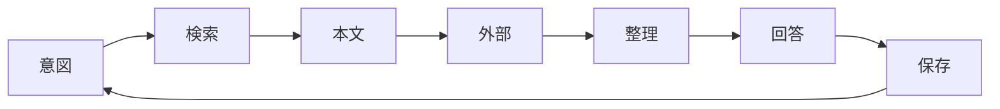

# Lumiere

Lumiere は、会議・チャット・ドキュメントの所在を記録するローカルの索引である。資料の本文は持たず、タイトル・所在・用語（クライアント・会議・人物・プロジェクトなど）だけを記録し、本文は所在のサービスから取得する。CLI の `~/batb/bin/batb` はどのディレクトリから実行しても同じ DB（ `~/batb/db/lumiere.sqlite` ）を読み書きするため、どのリポジトリで動く Agent も同じ手順で資料を引き、登録できる。

コマンドは常に `~/batb/bin/batb` で呼ぶ。batb の worktree にある `bin/batb` は、その worktree に空の DB を作って読み書きする。スキーマとコマンドの詳細は `~/batb/docs/lumiere.md` にある。

## Workflow

各ターンは意図、検索、本文、外部補完、整理、回答、保存の 7 段階を回す。同一会話内で既に取得した本文は使い回し、不要な再取得を避ける。



各段階を通じて次の原則を守る。

| principle | detail |
| :-- | :-- |
| 先に検索 | 回答・判断・実装の前に Lumiere を検索する |
| 自動保存 | 参照しうる資料と会話で得た新情報は、頼まれなくても登録する |
| 文脈の再利用 | 同一会話内の取得済み本文を使い回す |
| 不確実性の分離 | 合意・進行中・未確認を混同しない |
| 根拠の明示 | 議事録・課題・予定など、出典を示す |
| 推測の禁止 | Lumiere・Calendar・Backlog を見ずに断定しない |

## Lookup

検索では、クライアント名・会議名・プロジェクト名・課題キー・人名など、文脈から複数の手がかりを試す。まず `term infer` で文面から拾える用語を確かめ、その用語で `query --term` する。用語にならない言葉は、タイトルと所在へのキーワード検索で補う。

```bash
~/batb/bin/batb term infer "確定：トリプルエスさま定例"
~/batb/bin/batb term query トリプルエス
~/batb/bin/batb query --term トリプルエス
~/batb/bin/batb query 要件 HTML
~/batb/bin/batb query --limit 10
```

`query` は資料ごとにタイトル・ID・所在・用語を返す。論点や決定事項を突き合わせるときは、所在から本文を取得する。取得の手段は [Sources](#sources) の表に従う。

## Register

共有された資料や会話で参照した資料は、`save` で登録する。登録の前に所在の一部（Google Doc の ID、Backlog の課題キー、ファイル名など）で `query` し、登録済みの資料は登録し直さない。共有された URL は登録時に正規化されるため、URL 全体では一致しないことがある。同じ所在への再登録は同じ 1 件の上書きになり、学習で付いた用語の紐付けがタイトルからの推定で置き換わる。

`--require-term` を付けると、タイトルから用語を推定できない場合に登録を止める。止まったときは `term infer` の結果をユーザーに確認し、既存の用語を `--term` で明示してから登録する。`--term` には既存の用語しか渡せない。該当する用語が無ければ、名前と分類をユーザーに確認したうえで `term add` で追加する。会議は Google Calendar の予定名だけを用語にする。

```bash
~/batb/bin/batb query 1AbCdEfG
~/batb/bin/batb save --title "確定：トリプルエスさま定例" --source "https://docs.google.com/document/d/1AbCdEfG/edit" --require-term
~/batb/bin/batb term add --name "{用語}" --category client
~/batb/bin/batb save --title "..." --source "..." --term "{用語}" --term FDE
```

本文を読んだ資料は、`save` が返した ID に対して語彙を学習させる。本文から用語・別名・用語間の関係を抽出して JSON にまとめ、`term learn` の標準入力に渡す。JSON の形と抽出の規則は `~/batb/docs/lumiere.md` の Learning に従う。会議は語彙の学習で新しく作らない。

```bash
~/batb/bin/batb term learn <id> <<'EOF'
{"terms": [{"name": "トリプルエス", "category": "client"}], "relations": []}
EOF
```

## Sources

`--source` は種別ごとに次の形式で書く。形式をそろえると、同じ資料の重複登録を防げる。外部サービスに正本がある資料は、手元に写しがあっても URL を所在にする。

| type | source format | fetch |
| :-- | :-- | :-- |
| Backlog | `https://{space}.backlog.com/view/{ISSUE_KEY}` | `get_issue` / `get_issue_comments` |
| Slack | permalink URL | `slack_read_thread` / `slack_read_channel` / `slack_read_file` |
| Google Doc | `https://docs.google.com/.../d/{id}/edit` | `read_file_content` |
| Notion | `https://www.notion.so/{pageId}` | Notion MCP |
| local | ファイルのパス | ファイル read |

外部に正本を持たないローカルファイルは、パスを `--source` に渡すと `~/batb/files/` へコピーされ、そのコピーの絶対パスが所在になる。元のファイルが動いたり消えたりしても資料は残る。ファイル名が同じ資料は同じ 1 件として上書きされるため、日付や版を含む名前を付けてから登録する。
