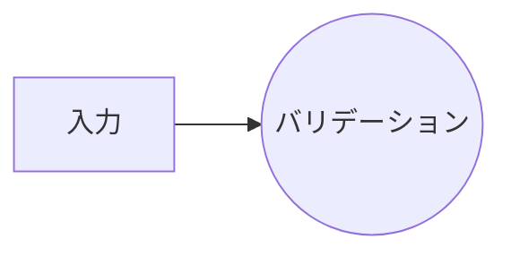
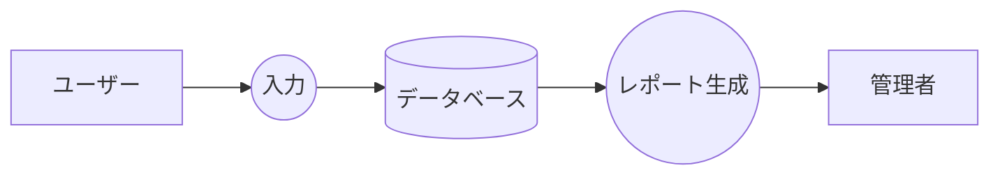

# Mermaid記述ルール

## 命名規則

- 変数名（ID）：camelCaseの英語で記述する。シンプルな単語または単語の組み合わせにする
- 表示名（ラベル）：日本語で記述する。シンプルな表現にする

## DFD（データフロー図）

外部エンティティとプロセスを以下の記法で区別する。

| 要素 | 記法 | 例 |
|------|------|------|
| 外部エンティティ | `[]` | `user["ユーザー"]` |
| プロセス | `(())` | `validate(("バリデーション"))` |

