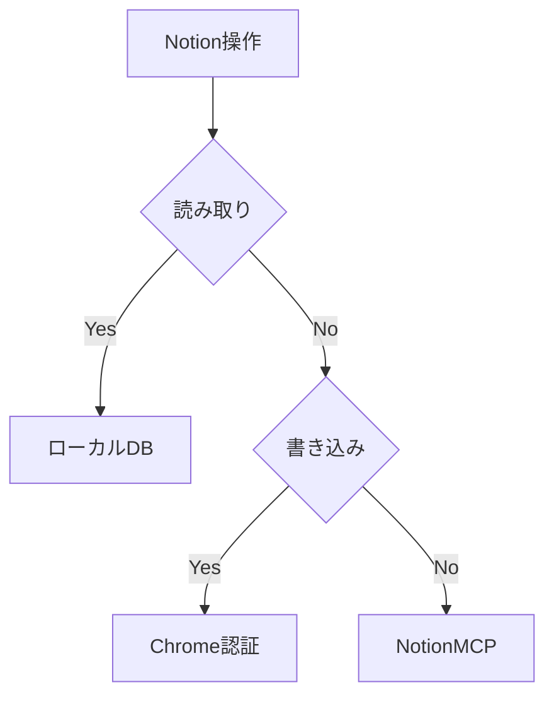

# Notion

activecore-swat-btoc ワークスペースの Notion を操作する Skill である。読み取りは Notion デスクトップアプリが同期したローカル DB から行い、書き込みは Chrome のセッション cookie と Notion 内部 API を使う。公式 REST API や Notion MCP が使えない環境でも、ここに書いた手順でページの取得とプロパティ更新ができる。

## Quick Start

操作の種類に応じて経路を選ぶ。読み取りはローカル DB、書き込みは Chrome cookie、MCP は認証済みの場合のみ使う。



Skill 同梱の `scripts/` を優先する。都度 Python を書くより、こちらの方が cookie 取得や API 呼び出しが安定する。

| 操作 | スクリプト |
| :-- | :-- |
| 認証確認 | `scripts/get_token.py` |
| 読み取り | `scripts/read_page.py` |
| 書き込み | `scripts/write_property.py` |

## Defaults

ワークスペース固有の定数は次のとおり。

| Key | Value |
| :-- | :-- |
| workspace | `activecore-swat-btoc` |
| `SPACE_ID` | `5cdf38b3-f525-464f-9874-5ff834c33aa2` |
| `USER_ID` | `182f67ed-59a1-44fc-8ce9-e634d4f2fbac` |
| local db | `~/Library/Application Support/Notion/notion.db` |
| Linear property id | `e~Y{` |

Notion URL から page ID を取り出す。例として `https://app.notion.com/p/R3-_-3a73694887fd8014ac9dedb195bcc859` なら page ID は `3a736948-87fd-8014-ac9d-edb195bcc859` である。

## Read Workflow

読み取りは Notion デスクトップアプリの同期が前提になる。アプリが開いていて、対象ページがローカルに反映されていることを確認してから `read_page.py` を実行する。

```bash
python3 ~/.claude/skills/notion/scripts/read_page.py <page_id>
python3 ~/.claude/skills/notion/scripts/read_page.py <page_id> --format text
```

`block` テーブルから DB プロパティと子ブロック本文の両方を取得する。ライブ API を叩かなくてよいので、読み取り専用タスクではこちらを第一選択にする。

## Write Workflow

書き込みは Chrome 側の Notion ログインが前提になる。依存パッケージは `browser-cookie3` である。

```bash
pip3 install browser-cookie3
python3 ~/.claude/skills/notion/scripts/get_token.py
python3 ~/.claude/skills/notion/scripts/write_property.py \
  <page_id> <property_id> '<json_args>'
```

Linear URL 列への書き込み例:

```bash
python3 ~/.claude/skills/notion/scripts/write_property.py \
  3a736948-87fd-8014-ac9d-edb195bcc859 e~Y{ \
  '[["https://linear.app/active-core-swat/issue/MRTTOPS-7222", [["a", "https://linear.app/active-core-swat/issue/MRTTOPS-7222"]]]]'
```

内部 API のエンドポイントと必須ヘッダーは次のとおり。

| Purpose | Endpoint |
| :-- | :-- |
| live read | `POST https://www.notion.so/api/v3/syncRecordValues` |
| write | `POST https://www.notion.so/api/v3/saveTransactions` |

| Header | Note |
| :-- | :-- |
| `Cookie` | `token_v2=...` |
| `x-notion-active-user-header` | `USER_ID` |
| `x-notion-space-id` | `SPACE_ID` |

## Task Checklist

作業は次の順で進める。

| Step | Action |
| :-- | :-- |
| 1 | URL から page ID を抽出する |
| 2 | 読み取りなら `read_page.py` を実行する |
| 3 | 書き込みなら `get_token.py` で認証を確認する |
| 4 | `write_property.py` で更新する |
| 5 | 書き込み確認は `syncRecordValues` か Notion UI で行う。`read_page.py` は同期遅延で古い値を返すことがある |

## Troubleshooting

| Symptom | Action |
| :-- | :-- |
| `token_v2 not found` | Chrome で Notion にログインする |
| page missing in local db | Notion デスクトップアプリの同期を待つ |
| desktop cookie decrypt fails | この経路は使わない |
| Notion MCP `needsAuth` | Cursor Desktop で MCP を認証する |

## Avoid

次の方法は、この環境では失敗しやすい。

| Method | Reason |
| :-- | :-- |
| Notion デスクトップ Cookie の手動 AES 復号 | 暗号化方式が変わり復号できない |
| 未設定の `NOTION_API_KEY` | Integration Token が存在しない |
| 未認証の Notion MCP | Agent 環境から OAuth できない |

## Related Script

Linear URL の一括更新だけを行う用途限定スクリプトは `~/Documents/marutto-operation/scripts/update-notion-linear-links.py` にある。汎用操作は本 Skill の `scripts/` を使う。
