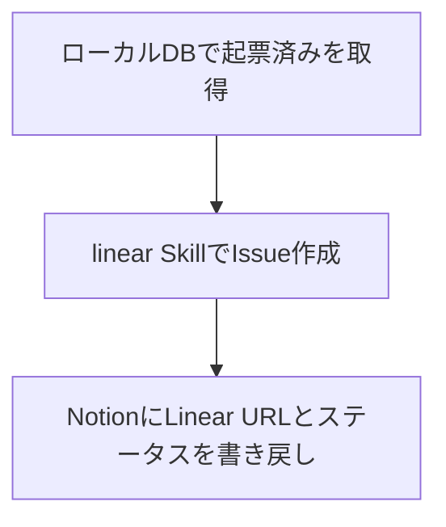

# notion2linear

activecore-swat-btoc ワークスペースの Notion DB を読み、Linear Issue を起票し、Notion に書き戻す Skill である。読み取りは Notion デスクトップアプリが同期したローカル DB から行い、書き込みは Chrome のセッション cookie と Notion 内部 API を使う。Issue 作成は `linear` Skill のデフォルトに従う。

## Quick Start



| 操作 | スクリプト |
| :-- | :-- |
| 認証確認 | `scripts/get_token.py` |
| 読み取り | `scripts/read_page.py` |
| 書き込み | `scripts/write_property.py` |

## Defaults

書き込み API 用の ID はリポジトリに含めない。`skills/notion2linear/.env` またはシェル環境変数で設定する。

```bash
cp ~/.claude/skills/notion2linear/.env.example ~/.claude/skills/notion2linear/.env
# NOTION_USER_ID / NOTION_SPACE_ID を記入
```

| Key | Source |
| :-- | :-- |
| `NOTION_USER_ID` | `.env` または環境変数 |
| `NOTION_SPACE_ID` | `.env` または環境変数 |
| local db | `~/Library/Application Support/Notion/notion.db` |
| Linear property id | `e~Y{` |
| ステータス property id | `?lCf` |

ID の取得方法: Chrome DevTools の Network タブで Notion API リクエストの `x-notion-active-user-header` と `x-notion-space-id` ヘッダーを参照する。

Notion URL から page ID を取り出す。例として `https://app.notion.com/p/R3-_-3a73694887fd8014ac9dedb195bcc859` なら page ID は `3a736948-87fd-8014-ac9d-edb195bcc859` である。

## Notion → Linear Workflow

マーケOps-改善項目など、Notion DB の「起票済み」レコードを Linear Issue に落とすときは次の順で進める。

1. ローカル `notion.db` からステータスが `起票済み` のレコードを取得する（`?lCf` プロパティ）
2. `linear` Skill のデフォルトで Issue を作成する（`marutto-ops` / `[FDE] 制作プロセス改善` / `Triage`）
3. Notion レコードに Linear URL を書き込む（`e~Y{` プロパティ）
4. Notion レコードのステータスを **`着手未定`** に更新する（`?lCf` プロパティ）

### ステータス更新ルール

Issue 起票後の Notion ステータスは **必ず `着手未定`** とする。`着手予定` にはしない。

```bash
python3 ~/.claude/skills/notion2linear/scripts/write_property.py \
  <page_id> '?lCf' '[["着手未定"]]'
```

### Linear URL 書き込み例

```bash
python3 ~/.claude/skills/notion2linear/scripts/write_property.py \
  <page_id> e~Y{ \
  '[["https://linear.app/active-core-swat/issue/MRTTOPS-7222", [["a", "https://linear.app/active-core-swat/issue/MRTTOPS-7222"]]]]'
```

## Read Workflow

読み取りは Notion デスクトップアプリの同期が前提になる。アプリが開いていて、対象ページがローカルに反映されていることを確認してから `read_page.py` を実行する。

```bash
python3 ~/.claude/skills/notion2linear/scripts/read_page.py <page_id>
python3 ~/.claude/skills/notion2linear/scripts/read_page.py <page_id> --format text
```

`block` テーブルから DB プロパティと子ブロック本文の両方を取得する。ライブ API を叩かなくてよいので、読み取り専用タスクではこちらを第一選択にする。

DB レコードの絞り込み例（`起票済み`）:

```sql
SELECT id, properties
FROM block
WHERE parent_id = '<collection_id>'
  AND parent_table = 'collection'
  AND alive = 1
  AND properties LIKE '%起票済み%';
```

## Write Workflow

書き込みは Chrome 側の Notion ログインが前提になる。依存パッケージは `browser-cookie3` である。

```bash
pip3 install browser-cookie3
python3 ~/.claude/skills/notion2linear/scripts/get_token.py
python3 ~/.claude/skills/notion2linear/scripts/write_property.py \
  <page_id> <property_id> '<json_args>'
```

内部 API のエンドポイントと必須ヘッダーは次のとおり。

| Purpose | Endpoint |
| :-- | :-- |
| live read | `POST https://www.notion.so/api/v3/syncRecordValues` |
| write | `POST https://www.notion.so/api/v3/saveTransactions` |

| Header | Note |
| :-- | :-- |
| `Cookie` | `token_v2=...` |
| `x-notion-active-user-header` | `NOTION_USER_ID` |
| `x-notion-space-id` | `NOTION_SPACE_ID` |

## Task Checklist

| Step | Action |
| :-- | :-- |
| 1 | URL から page ID を抽出する |
| 2 | 読み取りなら `read_page.py` または `notion.db` を使う |
| 3 | Issue 作成なら `linear` Skill に従い `save_issue` する |
| 4 | 書き込み前に `get_token.py` で認証を確認する |
| 5 | Linear URL（`e~Y{`）とステータス（`?lCf` → `着手未定`）を書き込む |
| 6 | 書き込み確認は `syncRecordValues` か Notion UI で行う |

## Troubleshooting

| Symptom | Action |
| :-- | :-- |
| `token_v2 not found` | Chrome で Notion にログインする |
| page missing in local db | Notion デスクトップアプリの同期を待つ |
| desktop cookie decrypt fails | この経路は使わない |
| Notion MCP `needsAuth` | Cursor Desktop で MCP を認証する |

## Avoid

| Method | Reason |
| :-- | :-- |
| Notion デスクトップ Cookie の手動 AES 復号 | 暗号化方式が変わり復号できない |
| 未設定の `NOTION_API_KEY` | Integration Token が存在しない |
| 未認証の Notion MCP | Agent 環境から OAuth できない |
| Issue 起票後にステータスを `着手予定` にする | 運用ルールでは `着手未定` が正 |

## Related Script

Linear URL の一括更新だけを行う用途限定スクリプトは `~/Documents/marutto-operation/scripts/update-notion-linear-links.py` にある。汎用操作は本 Skill の `scripts/` を使う。
