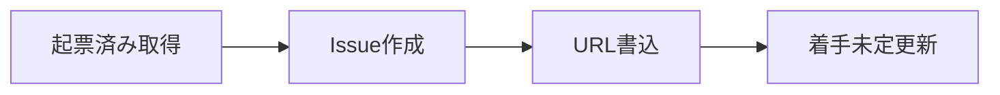

# notion2linear

マーケOps-改善項目 Notion DB の `起票済み` レコードを Linear Issue に起票し、結果を Notion に戻す Skill です。Notion や Linear へのアクセス手段は利用者の環境に合わせ、本 Skill は対象 DB・更新ルール・起票内容だけを定義します。

## 対象DB

| 項目 | 値 |
| :-- | :-- |
| DB名 | マーケOps-改善項目 |
| Collection ID | `2fc36948-87fd-8039-ab2f-000bf93b1cbf` |
| Page ID | `2fc36948-87fd-808a-a0c4-cea50585a6eb` |
| URL | https://www.notion.so/2fc3694887fd808aa0c4cea50585a6eb |
| 配置 | `marutto1to1` ページ内 |

## プロパティ

起票時に参照・更新するプロパティは表示名で記載します。

| プロパティ | 用途 |
| :-- | :-- |
| ステータス | `起票済み` の絞り込み。起票後は `着手未定` に更新 |
| Linear | 起票した Issue URL の書き込み |
| タイトル | Issue タイトルの元 |
| クライアント | Issue description への記載 |
| 工程 | Issue description への記載 |
| 優先度 | Linear の priority にそのまま反映 |

## ワークフロー

1. ステータスが `起票済み` のレコードを取得する
2. 重複がないことを確認し、Linear Issue を作成する
3. Notion の `Linear` プロパティに Issue URL を書き込む
4. Notion の `ステータス` を `着手未定` に更新する

タイトル未入力のレコードは起票しません。

### Issue作成

| 項目 | ルール |
| :-- | :-- |
| title | `[<クライアント>] <Notion タイトル>`（例: `[トリプルエス] サブコピーのフォントサイズを…`） |
| description | 背景、スコープ、完了条件、Notion URL、クライアント、工程 |
| priority | Notion の `優先度` をそのまま使う。High → `2`、Medium → `3`、Low → `4` |

team・project・status など、その他の Issue 属性はチームの運用に合わせて設定します。

### 書き戻し

Issue 起票後の Notion ステータスは `着手未定` にします。 `着手予定` は使いません。

## チェックリスト

| 手順 | 完了 |
| :-- | :-- |
| `起票済み` レコードを取得した | [ ] |
| 重複確認後に Issue を作成した | [ ] |
| Notion の `Linear` に URL を書き込んだ | [ ] |
| Notion の `ステータス` を `着手未定` に更新した | [ ] |

## 制約

| 禁止事項 | 理由 |
| :-- | :-- |
| 起票後にステータスを `着手予定` にする | 正しい値は `着手未定` |
| タイトル未入力レコードを起票する | 内容を特定できない |
