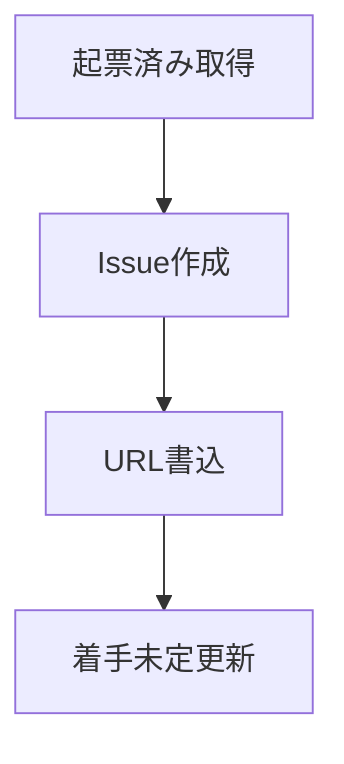

# notion2linear

マーケOps-改善項目 Notion DB の `起票済み` レコードを Linear Issue に起票し、結果を Notion に戻す Skill です。Notion の読み書きは `notion` Skill、Issue 作成は `linear` Skill に従います。

## 対象DB

対象はマーケOps-改善項目 DB です。 `marutto1to1` ページ内に埋め込まれています。

| 項目 | 値 |
| :-- | :-- |
| DB名 | マーケOps-改善項目 |
| Collection ID | `2fc36948-87fd-8039-ab2f-000bf93b1cbf` |
| Page ID | `2fc36948-87fd-808a-a0c4-cea50585a6eb` |
| URL | https://www.notion.so/2fc3694887fd808aa0c4cea50585a6eb |

## プロパティ

起票時に参照するプロパティは次のとおりです。

| プロパティ | ID | 用途 |
| :-- | :-- | :-- |
| ステータス | `?lCf` | `起票済み` の絞り込み、起票後の更新 |
| Linear | `e~Y{` | 起票した Issue URL の書き込み |
| タイトル | `title` | Issue タイトルの元 |
| クライアント | `?\vp` | Issue description への記載 |
| 工程 | `S\|ZN` | Issue description への記載 |
| 重要度 | `h?F}` | priority 判断の参考 |
| 緊急度 | `F:Bv` | priority 判断の参考 |
| 優先度 | `Imok` | priority 判断の参考 |
| サイズ | `~mqa` | スコープ判断の参考 |

## ワークフロー

起票から書き戻しまでの流れは、読み取り、Issue 作成、Notion 更新の 3 段階です。



1. ローカル `notion.db` からステータスが `起票済み` のレコードを取得する
2. `linear` Skill のデフォルトで Issue を作成する（`marutto-ops` / `[FDE] 制作プロセス改善` / `Triage`）
3. `notion` Skill の `write_property.py` で Linear URL を書き込む（`e~Y{`）
4. `notion` Skill の `write_property.py` でステータスを `着手未定` に更新する（`?lCf`）

### レコード取得

`起票済み` の絞り込みは次の SQL で行います。タイトル未入力のレコードは起票しません。

```sql
SELECT id, properties
FROM block
WHERE parent_id = '2fc36948-87fd-8039-ab2f-000bf93b1cbf'
  AND parent_table = 'collection'
  AND alive = 1
  AND properties LIKE '%起票済み%';
```

### Issue作成

Issue は Notion レコードの内容を元に作成します。作成前に `list_issues` で同タイトル・同内容がないことを確認します。

| 項目 | ルール |
| :-- | :-- |
| title | `[<クライアント>] <Notion タイトル>`（例: `[トリプルエス] サブコピーのフォントサイズを…`） |
| description | 背景、スコープ、完了条件、Notion URL、クライアント、工程、重要度 |
| priority | Notion の優先度（`Imok`）を参考に設定。High → `2`、Medium → `3`、Low → `4` |

### 書き戻し

Issue 起票後の Notion ステータスは `着手未定` にします。 `着手予定` は使いません。

```bash
python3 ~/.claude/skills/notion/scripts/write_property.py \
  <page_id> e~Y{ \
  '[["https://linear.app/active-core-swat/issue/MRTTOPS-7222", [["a", "https://linear.app/active-core-swat/issue/MRTTOPS-7222"]]]]'

python3 ~/.claude/skills/notion/scripts/write_property.py \
  <page_id> '?lCf' '[["着手未定"]]'
```

## チェックリスト

| 手順 | 完了 |
| :-- | :-- |
| `notion.db` から `起票済み` レコードを取得した | [ ] |
| `linear` Skill で重複確認後に Issue を作成した | [ ] |
| Notion に Linear URL（`e~Y{`）を書き込んだ | [ ] |
| Notion ステータスを `着手未定`（`?lCf`）に更新した | [ ] |

## 制約

運用で外してはいけない点は次の 3 つです。

| 禁止事項 | 理由 |
| :-- | :-- |
| 起票後にステータスを `着手予定` にする | 正しい値は `着手未定` |
| タイトル未入力レコードを起票する | 内容を特定できない |
| `notion` / `linear` Skill を飛ばして起票する | 認証、デフォルト、重複確認が漏れる |

## 関連

| 内容 | 参照先 |
| :-- | :-- |
| Notion 読み書き | `notion` Skill |
| Linear Issue 作成 | `linear` Skill |
| Linear URL 一括更新 | `~/Documents/marutto-operation/scripts/update-notion-linear-links.py` |
