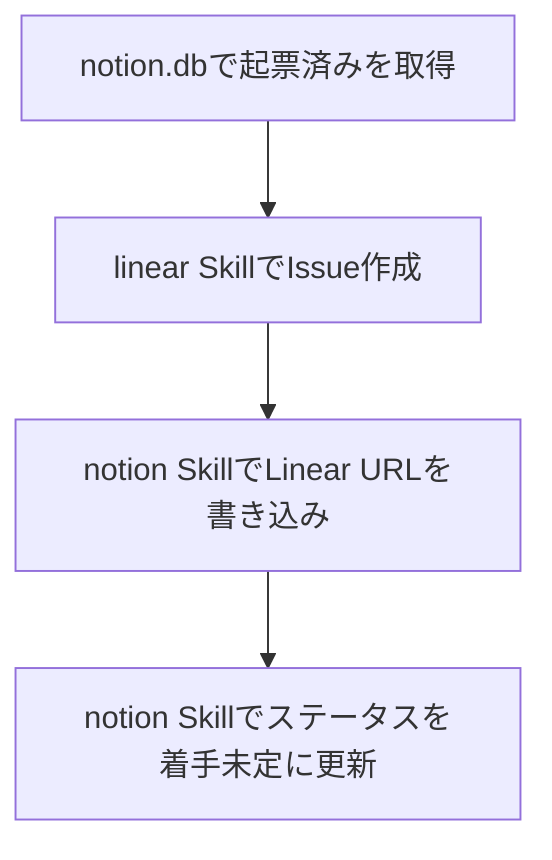

# notion2linear

マーケOps-改善項目 Notion DB の「起票済み」レコードを Linear Issue に落とし、Notion に書き戻す Skill である。Notion の読み取り・書き込みは `notion` Skill、Issue 作成は `linear` Skill に従う。

## 対象 DB

| 項目 | 値 |
| :-- | :-- |
| DB名 | マーケOps-改善項目 |
| Collection ID | `2fc36948-87fd-8039-ab2f-000bf93b1cbf` |
| Page ID | `2fc36948-87fd-808a-a0c4-cea50585a6eb` |
| URL | https://www.notion.so/2fc3694887fd808aa0c4cea50585a6eb |
| 配置 | `marutto1to1` ページ内に埋め込み |

### プロパティ（起票時に参照）

| プロパティ | property id | 用途 |
| :-- | :-- | :-- |
| ステータス | `?lCf` | `起票済み` の絞り込み、起票後の更新 |
| Linear | `e~Y{` | 起票した Issue URL の書き込み |
| タイトル | `title` | Issue タイトルの元 |
| クライアント | `?\vp` | Issue description への記載 |
| 工程 | `S\|ZN` | Issue description への記載 |
| 重要度 | `h?F}` | priority 判断の参考 |
| 緊急度 | `F:Bv` | priority 判断の参考 |
| 優先度 | `Imok` | priority 判断の参考 |
| サイズ | `~mqa` | スコープ判断の参考 |

## Workflow



1. ローカル `notion.db` からステータスが `起票済み` のレコードを取得する
2. `linear` Skill のデフォルトで Issue を作成する（`marutto-ops` / `[FDE] 制作プロセス改善` / `Triage`）
3. `notion` Skill の `write_property.py` で Linear URL を書き込む（`e~Y{`）
4. `notion` Skill の `write_property.py` でステータスを **`着手未定`** に更新する（`?lCf`）

### 起票済みレコードの取得

```sql
SELECT id, properties
FROM block
WHERE parent_id = '2fc36948-87fd-8039-ab2f-000bf93b1cbf'
  AND parent_table = 'collection'
  AND alive = 1
  AND properties LIKE '%起票済み%';
```

タイトル未入力のレコードは起票しない。

### Issue 作成

- title: `[<クライアント>] <Notion タイトル>` 形式（例: `[トリプルエス] サブコピーのフォントサイズを…`）
- description: 背景・スコープ・完了条件・Notion URL・クライアント/工程/重要度など
- priority: Notion の優先度（`Imok`）を参考に設定。High → `2`, Medium → `3`, Low → `4`
- 重複確認: `list_issues` で同タイトル・同内容がないことを確認してから作成

### Notion 書き戻し

Issue 起票後の Notion ステータスは **必ず `着手未定`** とする。`着手予定` にはしない。

```bash
# Linear URL
python3 ~/.claude/skills/notion/scripts/write_property.py \
  <page_id> e~Y{ \
  '[["https://linear.app/active-core-swat/issue/MRTTOPS-7222", [["a", "https://linear.app/active-core-swat/issue/MRTTOPS-7222"]]]]'

# ステータス
python3 ~/.claude/skills/notion/scripts/write_property.py \
  <page_id> '?lCf' '[["着手未定"]]'
```

## Task Checklist

- [ ] `notion.db` から `起票済み` レコードを取得した
- [ ] `linear` Skill で重複確認後に Issue を作成した
- [ ] Notion に Linear URL（`e~Y{`）を書き込んだ
- [ ] Notion ステータスを `着手未定`（`?lCf`）に更新した

## Avoid

| やってはいけないこと | 理由 |
| :-- | :-- |
| Issue 起票後にステータスを `着手予定` にする | 運用ルールでは `着手未定` が正 |
| タイトル未入力レコードを起票する | 内容が特定できない |
| `notion` / `linear` Skill を飛ばして独自手順で起票する | 認証・デフォルト・重複確認が漏れる |

## Related

- 汎用 Notion 操作: `notion` Skill
- Linear Issue 作成デフォルト: `linear` Skill
- Linear URL 一括更新: `~/Documents/marutto-operation/scripts/update-notion-linear-links.py`
